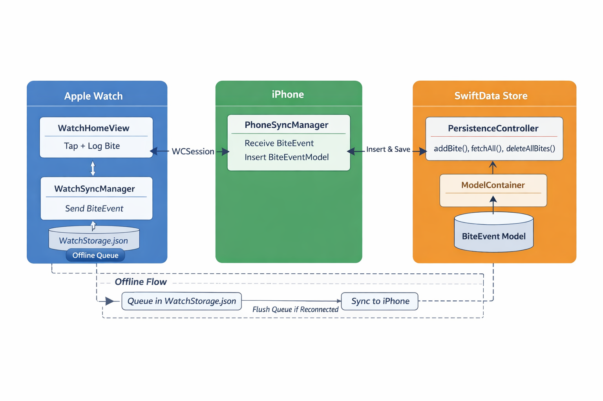

# NailGuard Architecture and Data Flow

This document describes the class-level architecture and data flow for the NailGuard iOS + watchOS app.

---

## 1. High-Level Architecture Overview

```text
+-------------------+           +-------------------+       +----------------------+
|   Apple Watch     |           |      iPhone       |       |   SwiftData Store    |
|  (Watch App UI)   |           |  (iOS Target)     |       | BiteEventModel.swift |
+-------------------+           +-------------------+       +----------------------+
| WatchHomeView     |           | DashboardView     |       | ModelContainer       |
|                   |           | TrendsView        |       | mainContext          |
| Button Tap + Log  |---------->| PhoneSyncManager  |------>| addBite(), fetchAll()|
| BiteEvent         | WCSession | insert()          |       | save()               |
| (Codable struct)  |           | save()            |       |                      |
| WatchStorage.json |           |                   |       |                      |
+-------------------+           +-------------------+       +----------------------+
```

---

## 2. Class-Level Relationships

| Class / Struct | Target | Responsibility |
|----------------|--------|----------------|
| WatchHomeView | Watch UI | User taps “Log Bite”, displays today’s count & streak |
| WatchSyncManager | Watch Extension | Sends `BiteEvent` (Codable) to iPhone via `WCSession`, flushes queue if offline |
| WatchStorage | Watch Extension | Temporary JSON queue for offline events |
| PhoneSyncManager | iOS | Receives Watch events, converts them into `BiteEventModel` and inserts into SwiftData |
| PersistenceController | iOS | Singleton; holds `ModelContainer`, provides `context` for inserts/fetches |
| BiteEventModel | iOS SwiftData | Persistent model; represents a bite event in the iPhone database |
| DashboardView / TrendsView | iOS SwiftUI | Reads from SwiftData via `@Query` or `PersistenceController.fetchAllBites()`, renders counts, streaks, charts |

---

## 3. Data Flow Step-By-Step

1. **User taps + Log Bite on Watch**
   - `WatchHomeView` creates a `BiteEvent` (Codable struct)
   - Optionally stores it in `WatchStorage.json` if offline

2. **Sync to iPhone**
   - `WatchSyncManager` uses `WCSession.sendMessage()` to send `BiteEvent` dictionary to iPhone

3. **iPhone receives event**
   - `PhoneSyncManager` receives message via `WCSessionDelegate`
   - Creates a `BiteEventModel` (SwiftData entity)
   - Inserts it into `PersistenceController.shared.context` → saves via SwiftData

4. **Update iPhone UI**
   - `DashboardView` / `TrendsView` using `@Query` automatically detect change in `ModelContainer` and update
   - Streaks, counts, weekly trends refresh automatically

5. **Persistence**
   - All events are stored in SwiftData (`ModelContainer`) on iPhone
   - iCloud sync can be added later if desired

---

## 4. Edge Cases / Offline Handling

- Watch logs bite while iPhone is unreachable → stored in `WatchStorage.json`
- On next connection → `WatchSyncManager.flushQueue()` sends queued events
- No data loss; iOS SwiftData remains **single source of truth**

---

## 5. ASCII Diagram of Data Flow

```text
[WatchHomeView]             [WatchSyncManager]                [PhoneSyncManager]          [PersistenceController / SwiftData]
       |                           |                                  |                             |
   +---+---+                       |                                  |                             |
   | Tap + Log Bite |-------------->| Send BiteEvent (WCSession) ----->| Insert BiteEventModel ------>|
   +---+---+                       |                                  |                             |
       | Store offline JSON?        |                                  |                             |
       |--------------------------- flushQueue if offline ------------>                             |
       |                           |                                  |                             |
       v                           v                                  v                             v
[WatchStorage.json]           WCSession reaches iOS                 Context insert             ModelContainer saves
       |                           |                                  |                             |
       +------------------------------------------------------------->|---------------------------->|
```


**Legend:**
- **Shared Codable struct** = `Shared/Models/BiteEvent.swift`
- **iOS SwiftData entity** = `BiteEventModel.swift`
- **WatchStorage** = JSON queue saved in App Group folder
- **PhoneSyncManager** = reads JSON queue from Watch + inserts into SwiftData

---

## 6. Key Points

- **Watch** is a lightweight edge device → stores only temporary JSON + sends events to phone
- **iPhone** is **source of truth** → all events persist in SwiftData
- **Shared struct** decouples Watch from SwiftData
- **Reactive SwiftUI views** update automatically via `@Query` or context fetches
- Offline and reconnects handled safely via WatchStorage + flushQueue