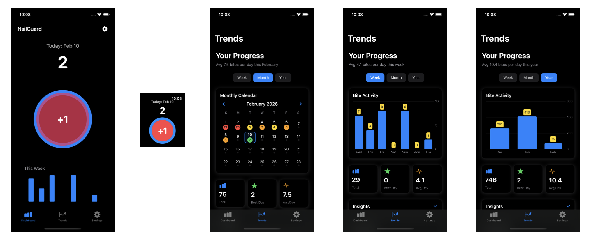

# NailGuard
<p align="Left">
  
</p>
A bite tracking iOS and watchOS app built with SwiftUI, SwiftData, and WatchConnectivity. 
<br><br>

  "Whenever you feel you want to bite your nails, just tap the button on your watch or phone, and NailGuard will record the time and date.  You can view your progress on both your watch and phone.  The iPhone app provides more detailed analytics and settings."

## Overview

NailGuard helps you track nail biting habits across your iPhone and Apple Watch. 
<p align="Left">
  
</p>

The app provides:


- **Real-time tracking** - Log bites from your Apple Watch with a single tap
- **Dashboard** - View today's count and weekly trends
- **Trends Analytics** - Detailed charts showing weekly, monthly, and yearly patterns
- **Calendar View** - Monthly heatmap showing bite activity
- **Insights** - Automated analysis of your progress and patterns
- **Peak Times** - Heatmap showing when you bite most during the day

## Architecture

```
+-------------------+           +-------------------+       +----------------------+
|   Apple Watch     |           |      iPhone       |       |   SwiftData Store    |
|  (Watch App UI)   |           |  (iOS Target)     |       | BiteEventModel.swift |
+-------------------+           +-------------------+       +----------------------+
| WatchHomeView     |           | DashboardView     |       | ModelContainer       |
|                   |           | TrendsView        |       | mainContext          |
| Button Tap + Log  |---------->| PhoneSyncManager  |------>| addBite(), fetchAll()|
| BiteEvent         | WCSession | insert()          |       | save()               |
| (Codable struct)  |           | save()            |       |                      |
+-------------------+           +-------------------+       +----------------------+
```

## Features

### iPhone App
- **Dashboard**: Today's bite count with a 7-day bar chart
- **Trends**: 
  - Weekly view: Bar chart of last 7 days
  - Monthly view: Interactive calendar with color-coded days
  - Yearly view: Monthly aggregated data
- **Insights**: Progress tracking and pattern analysis
- **Peak Times**: Hourly heatmap showing when bites occur most

### Apple Watch App
- Quick-log bites with a single tap
- Today's counter and streak display
- Offline storage with automatic sync when connected

## Requirements

- iOS 17.0+
- watchOS 10.0+
- Xcode 15.0+
- Swift 5.9+

## Setup

1. Clone the repository:
   ```bash
   git clone https://github.com/yourusername/NailGuard.git
   cd NailGuard
   ```

2. Open the project in Xcode:
   ```bash
   open NailGuard.xcodeproj
   ```

3. Select your development team in:
   - Project → NailGuard → Signing & Capabilities
   - Project → NailGuardWatch Watch App → Signing & Capabilities

4. Build and run on a simulator or device

## Project Structure

```
NailGuard/
├── NailGuardApp.swift              # App entry point
├── DashboardView.swift             # Main dashboard
├── TrendsView.swift                # Analytics views
├── TrendsViewModel.swift           # MVVM ViewModel for Trends
├── SettingsView.swift              # Settings screen
├── PersistenceController.swift     # SwiftData singleton
├── Shared/
│   ├── Models/
│   │   └── BiteEvent.swift         # Shared Codable model
│   └── CircularButton.swift        # Reusable button component
├── NailGuardTests/                 # Unit tests
└── NailGuardUITests/               # UI tests

NailGuardWatch Watch App/
├── NailGuardWatchApp.swift         # Watch app entry
├── WatchHomeView.swift             # Watch main interface
├── WatchSyncManager.swift          # WatchConnectivity handler
├── WatchStorage.swift              # Offline JSON storage
└── SyncViewModel.swift             # Watch MVVM ViewModel
```

## Key Technologies

- **SwiftUI** - Modern declarative UI framework
- **SwiftData** - Object persistence and querying
- **WatchConnectivity** - Communication between iOS and watchOS
- **Swift Charts** - Beautiful data visualization
- **MVVM Architecture** - Clean separation of concerns

## Data Model

```swift
@Model
final class BiteEventModel {
    @Attribute(.unique) var id: UUID
    var timestamp: Date
    
    init(id: UUID = UUID(), timestamp: Date = Date()) {
        self.id = id
        self.timestamp = timestamp
    }
}
```

## License

MIT License - see LICENSE file for details.

## Contributing

1. Fork the repository
2. Create a feature branch (`git checkout -b feature/amazing-feature`)
3. Commit your changes (`git commit -m 'Add amazing feature'`)
4. Push to the branch (`git push origin feature/amazing-feature`)
5. Open a Pull Request

## Support

For issues and feature requests, please use the GitHub Issues page.
